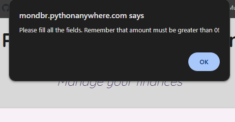

# **Web Services and Applications** 

by Monika Dabrowska

This repository is for the project component of the WSAA module for the Programming for Data Analytics module in the Higher Diploma in Data Analytics course at ATU in the summer semester of 2024/25.

The requierement of the project is to *write a program that demonstrates that you understand creating and consuming RESTful APIs*

The purpose is to create a web-based application that performs **CRUD operations** via a **REST API**, with an interface that dynamically interacts with a **mySQL** database.

The key goals are:
* Implement a RESTful backend with Flask.
* Build a responsive frontend to work with API using AJAX.
* Link the application to a database to work on data.
* Optionally, integrate an external data source and host the solution     online.

As my approach to this project, I decided to create a personal finance tracker web app using **Flask**, **MySQL**, and **JavaScript**.
It has an easy-to-use frontend that interacts with a **RESTful API** to perform real-time **CRUD** operations. The backend uses a **MySQL** database, and it connects to [freecurrencyapi](https://freecurrencyapi.com/) to real-time convert expenses from Euro to Dollar. 
I deployed the app on PythonAnywhere so it’s accessible online anytime for demonstration.

---
Hosted version: 
---
This project is hosted on PythonAnywhere. 
No local setup is required to run or test the application.
The root URL of my Flask web application is under this link:

https://mondbr.pythonanywhere.com

It will open a home page with the message *Welcome to the Personal Budget Tracker where you can manage your spending!*

This URL is a entry point to the backend and Flask routes `@app.route`:

* `/transactions/<int:id>`
* `/transactions`
* `/download_transactions`
* `/transactions/balance`


The direct path to a **static HTML file** which delivers intractive user interface is here: 

https://mondbr.pythonanywhere.com/static/finance_tracker.html

---

## Web app features: 
*  Add, view, update, and delete financial transactions (CRUD)
* Automatic currency conversion (EUR to USD) via [FreeCurrencyAPI](https://freecurrencyapi.com/)
* User-friendly frontend interface with styled transaction table
*  Deployed and accessible online via [PythonAnywhere](https://www.pythonanywhere.com/)
*  Downloadable CSV report and balance calculation
* Embedded animated video on homepage


## Technologies Used
* **Python + Flask**
* **MySQL (Connector: mysql-connector-python)**
* **HTML/CSS + jQuery + AJAX**
* **FreeCurrencyAPI (external data source)**
* **Hosted on PythonAnywhere**


## Handling Sensitive Data

To ensure that the settings and passwords are stored securely:
* `dbconfig` conains private connection settings and is excluded from Git using `.gitignore`, however the file is stored manually in my pythonanywhere account. 
* A placeholder `dbconfig_example.py` is included instead
* `config.py` containing my apikey to connect to FreeCurrencyAPI is also exlcuded from git using `.gitignore` and stored maunally in pythonanywhere.
* the `@app.route('/get-api-key', methods=['GET'])` securely returns the API key stored in my configuration so the frontend can use it without using the acutal key.

---

## Project Structure 
```
WSAA_project/
├── static/                  # HTML, animation file
├── images/                  # snips from the app
├── config.py               # API key (excluded from Git)
├── dbconfig.py              # Server Database credentials (excluded from Git)
├── dbconfig_example.py      # Example config for credentials
├── flask_app_server.py      # Flask app
├── TransactionDAO.py        # Data access
├── requirements.txt         # Python dependencies
├── README.md                # This file
└── .gitignore               # Git exclusion files
```


## Description of the Personal Budget Tracker app

The idea of my application is to create a interactive tool where daily transactions can be recorded and tracked. It allows to create the transaction (income or expense), but also allows to edit its details or delete it. 

With connection to [FreeCurrencyAPI](https://freecurrencyapi.com/), this application automatically converts entered EUR amount to USD amount in real time (as of entry date). 

There are additional features like **Download CSV** button that allows to dowload a file with database contains and **Calculate your Balance** button that sums up the transactions in EUR. 

To open the app, click [here](https://mondbr.pythonanywhere.com/static/finance_tracker.html):

This interactive page `finance_tracker.html` is built using HTML and styled with CCS.

It includes a header with the app name and short overview of the purpose. 
Two main buttons `Create New Transaction` and `View All Transactions` using `<button>` and styled with custom CSS classes in `finance_tracker.html` .

Clicking either button triggers JavaScript functions `showCreate()` or `fetchTransactions()` (respectively) that hide the intro view and shows the relevant interface (a form or table).

A looping animation using the `<video>` tag placed inside a div container is improving the visual experience.


After you click on `Create New Transaction` the button runs the JavaScript function `showCeate()` in `finance_tracker.html`. It hides the homepage buttons and video animation and displays the transaction table `<div id="createUpdateForm>` that was initially hidden. 
We can see a **Create** button for the following fields:
- Description
- Amount 
- Transaction Type (income or expense)
- Date of transaction (be aware that the currency exchange will be as of today)

After filling the form and clicking **Create** button, it triggers the `doCreate` function which gets the data and sends a POST request to Flask via AJAX. If it is succesful, transaction table is updated and shows updated list `transactionsTableDiv`.


There is also a **Go back** button which triggers the `goBack()` function to hide specific elements and go back to main page.


---


You can also easily modify or remove existing transactions via the interactive table:

**Update** button opens a pre-filled (description and transactions type current details) using `showUpdateForm()` function. Submitting the form run `doUpdate()` function and sends an AJAX PUT request to the Flask `(/transactions/<id>)` which updates the record in the MySQL database.  The database is updated and refreshes the frontend to show the latest data.


**Delete:** button sends a AJAX DELETE request to the Flask  `(/transactions/<id>)`. The backend delegates the deletion to the `TransactionDAO.delete(id)` method, which executes a SQL DELETE command to remove the record from the database. Once deleted, the corresponding row is also removed from the HTML table on the frontend. It also shows a pop up message that that the transaction is deleted by `alert()`.


---

**Download button** export all current transaction records to a .csv file using `downloadCSV()` function. 

**Calculate your Balance** button uses `calculateTotal()` function tied to `/transactions/balance` Flask route. It sends a GET request to the Flask API at `https://mondbr.pythonanywhere.com/transactions/balance` to retrieve the current total balance from all transactions. When is received, it extracts the balance. I also added a formatting to show comma and two decimal places `toLocaleString` 
The balance is displayed with HTML element `id="totalAmount"` and toggles the visibility of the container element with `id="totalDisplay"` between none and block, so the balance either shows or hides each time the function is called.


These interactions are handled via JavaScript functions and the Flask backend routes defined in `flask_app_server.py`.

By using `if` statements there are a controls in place that application will not allow to create or update transaction if any of the fields are missing. If user would add a white spaces, it will not allow as well - it is controlled by `trim()`.

Also, it will not allow to add a negative transaction amount. All amounts should be greater than zero, as there are types (income or expense), where incomes are increasing the total balance and expenses are deducted from the balance. 

If any of the fields are missing or negative or 0 as amount is entered, the following `alert()` is shown:




---

The application is visually styled using a soft grey and lavender color palette, with modern interface. This application can be extended with future features like notifications, more categories tools (second table in MySQL), budgeting tools, analytics dashboard, or individual accounts creating option. 


## Technical Overview 
***
### Frontend
---
**File `finance_tracker.html`**
Is buitl with **HTML, CSS and JavaScript** the frontend is interactive and communicates with the backend through AJAX

The functions are:
* `showCreate()`- Displays the form to create a new transaction
* `fetchTransactions()`- Loads all the transactions using HTML via `GET/transactions`
* `doCreate()` - Takes from input and sends a `POST` request to add new transaction
* `showUpdate()` -  Filling the form with current transaction details and allows to edit
* `doUpdate()` sends a `PUT` request to update record by ID
* `doDelete()` sends a `DELETE` request and removes the row from the transaction table. Pop-up window is shown using `alert("Transaction deleted successfully")`
* `calculateTotal()` sends `GET` request to `/transactions/balance` with specific format, switches on/off of display of total balance.
* `downloadCSV()` - allows to download a file from `/download_transactions`

---

### Backend (Flask API)
---

**File `flask_app_server.py`**
A RESTful Flask server is processing all frontend requests and communicates with the database via a DAO layer.

The Routes are:
* `GET /transactions` - returns all transaction data as JSON
* ` POST /transactions` - creates a new transaction and converts EUR to USD as of today
* ` PUT /transaction/<id> ` - updates an existing transaction by ID
* `DELETE / transactions/<id>` - deletes a transaction from MySQL database
* `GET /transactions/balance` - calculates total balance (income minus expenses )
* `GET /download_transactions` - generates and downloading CSV file for all transactions
* `get_exchange_rate()` - shows the current EUR to USD exchange rate 


### Data layer that connects to a database
---
**File `TransactionDAO.py`**
Data Access Object to keep database logic separately from application

The methods are:
* `get all()` - running `SELECT * FROM transaction and returns result as dict object
* `find_by_id()` - fetches a single transaction for viewing and update
* `create(transaction)` - insterting new transaction as per mySQL schema
* `update ()` - modifies transaction
* `delete ()` - deletes transaction 
* `convert_to_dictionary()` - converts database rows into Python dictionary  

### Database schema 
---

**Schema for the `transaction_table` used in the application:**

```
CREATE TABLE transaction (
    id INT NOT NULL AUTO_INCREMENT,
    description VARCHAR(100) NOT NULL,
    amount DECIMAL(10,2) NOT NULL,
    transaction_type ENUM('income', 'expense') NOT NULL,
    amount_in_usd DECIMAL(10,2),
    exchange_rate DECIMAL(10,4),
    date DATE,
    PRIMARY KEY (id)
);
```


## References

Basic structure and logic of the core of **TrancationDAO.py, finance_tracker.html, flask_app_server.py** and config files was written with reference to the WSAA (Web Services and Applications) lectures and example code provided in the deploypythonanywhere GitHub repository by Andrew Beatty.

Additional features, styiling and customising to meet my idea required additonal research. References and explanation to the code, including syntax and integration are provided within comments directly in the code. Below is a summary of most online resources used: 

* [Flask Documentation](http://flask.pocoo.org) – For routing, HTTP methods, and API design

* [MySQL Connector/Python](https://dev.mysql.com/doc/connector-python/en/) – For secure databse access

* [FreeCurrencyAPI Docs](https://github.com/everapihq/freecurrencyapi-python) – Used for live EUR to USD currency conversion

* [w3schools.com](https://www.w3schools.com) – For HTML/CSS and JavaScript basics and syntax

* [geeksforgeeks.org](www.geeksforgeeks.org) - For server connections, HTML/CSS and JavaScript

* [Stack Overflow](https://stackoverflow.com) – For debugging, code solutions, and integration examples

* [reddit.com](https://www.reddit.com) - code solutions

* [PythonAnywhere](https://www.pythonanywhere.com/) – For deploying the Flask web application

* [dev.mysql.com](https://dev.mysql.com) - For help in autoincrement IDs 

* [youtube.com](https://www.youtube.com) - for CSS styling ideas

* [developer.mozzila.org](https://developer.mozilla.org) - for CSS styling basics

ChatGPT – Was used for debugging and resolving indentation, and missing brackets errors. Supported me of code refferencing/commenting. This web app is my work and research. ChatGPT may suggest clearly incorrect ideas and make mistakes. In any case I had to re-work the code or text it generated to meet my own needs.

---

## About me: 

My name is Monika Dabrowska and I am an [ATU](https://www.atu.ie/) student of of the Programming and Scripting module on the Higher Diploma in Data Analytics course during Summer 2024/25.

I don't have any prevoius programming experience, so I am using multiple sources and references to help me to complete the assignments. 

If you wish to contact me directly, please email me @ mondab133@gmail.com


