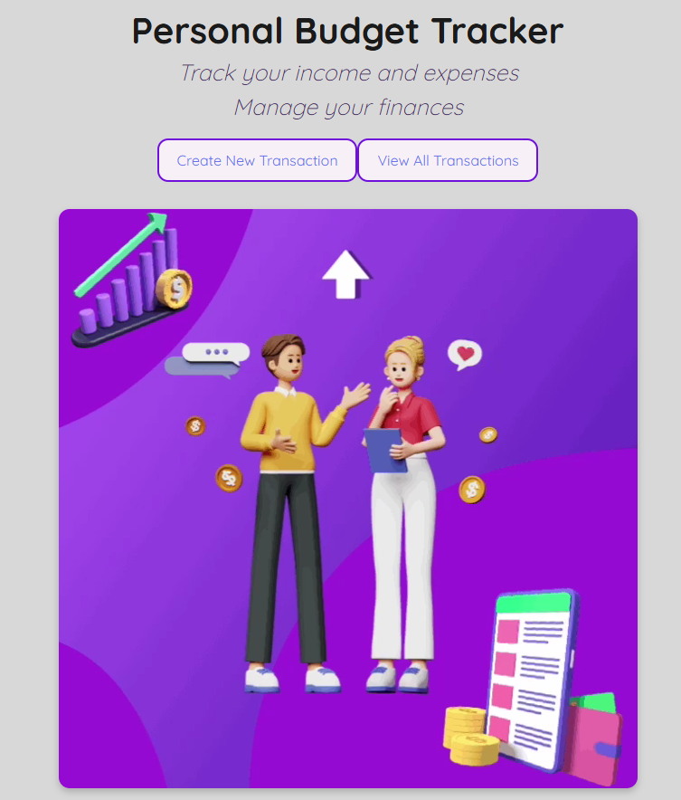
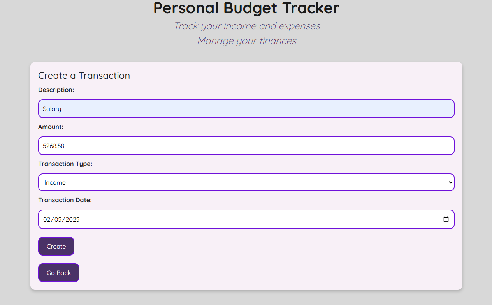
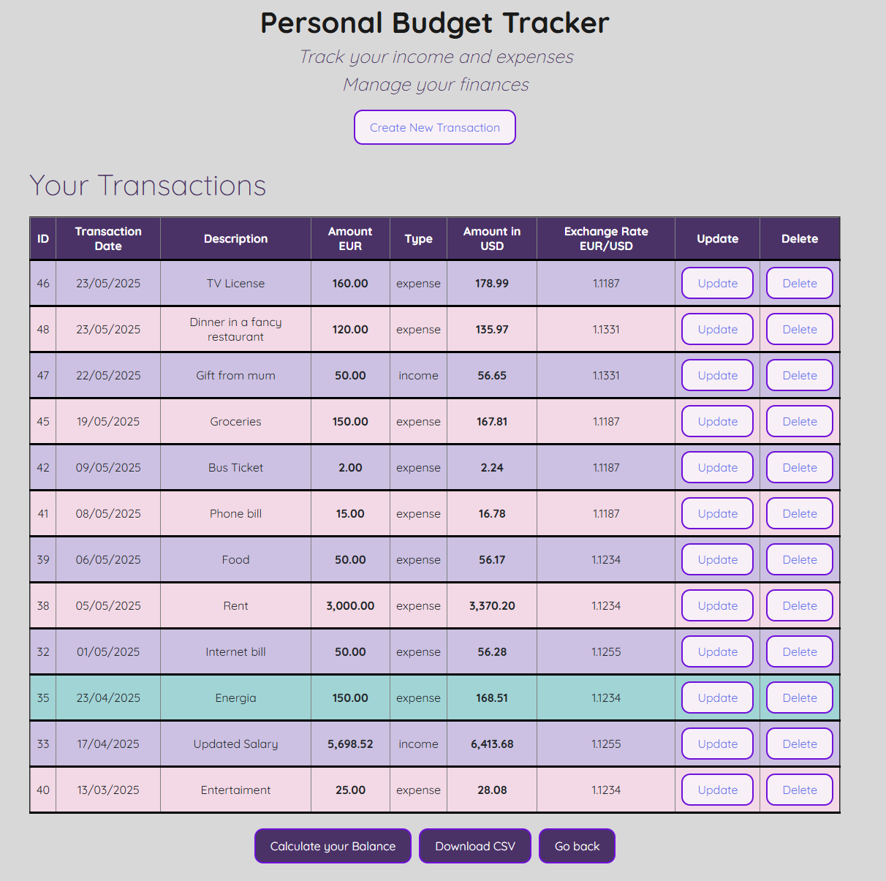
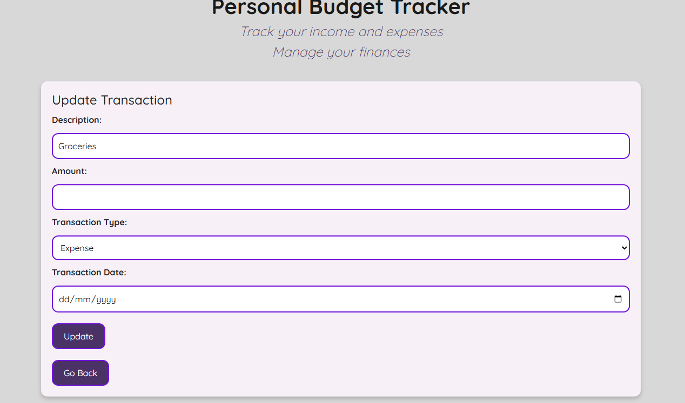
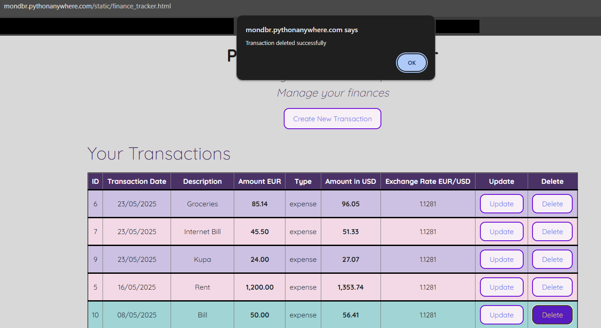
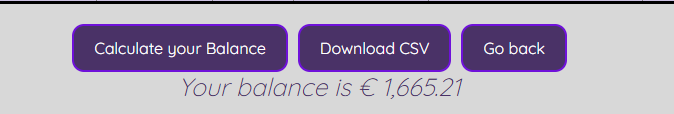

# **Web Services and Applications** 

by Monika Dabrowska

This repository is for the project component of the WSAA module for the Programming for Data Analytics module in the Higher Diploma in Data Analytics course at ATU in the summer semester of 2024/25.

The requierement of the project is to *write a program that demonstrates that you understand creating and consuming RESTful APIs*

The purpose is to create a web-based application that performs **CRUD operations** via a **REST API**, with an interface that dynamically interacts with a **mySQL** database.

The key goals are:
* Implement a RESTful backend with Flask.
* Build a responsive frontend to work with API using AJAX.
* Link the application to a database to work on data.
* Optionally, integrate an external data source and host the solution     online.

As my approach to this project, I created a personal finance tracker web app using **Flask**, **MySQL**, and **JavaScript**
It has an easy-to-use frontend that interacts with a **RESTful API** to perform real-time **CRUD** operations. The backend uses a **MySQL** database, and it connects to [freecurrencyapi](https://freecurrencyapi.com/) to real-time convert expenses from Euro to Dollar. 
I deployed the app on PythonAnywhere so it’s accessible online anytime for demonstration.

---
Hosted version: 
---
This project is hosted on PythonAnywhere. 
No local setup is required to run or test the application.
The root URL of my Flask web application is under this link:

https://mondbr.pythonanywhere.com

It will open a home page with the message *Welcome to the Personal Budget Tracker where you can manage your spending!*

This URL is a entry point to the backend and Flask routes `@app.route`:

* `/transactions/<int:id>`
* `/transactions`
* `/download_transactions`
* `/transactions/balance`


The direct path to a **static HTML file** which delivers intractive user interface: 

https://mondbr.pythonanywhere.com/static/finance_tracker.html

---

## Web app features: 
*  Add, view, update, and delete financial transactions (CRUD)
* Automatic currency conversion (EUR to USD) via [FreeCurrencyAPI](https://freecurrencyapi.com/)
* User-friendly frontend interface with styled transaction tables
*  Deployed and accessible online via [PythonAnywhere](https://www.pythonanywhere.com/)
*  Downloadable CSV report and balance calculation
* Embedded animated video on homepage


## Technologies Used
* **Python + Flask**
* **MySQL (Connector: mysql-connector-python)**
* **HTML/CSS + jQuery + AJAX**
* **FreeCurrencyAPI (external data source)**
* **Hosted on PythonAnywhere**


## Handling Sensitive Data

To ensure that the settings and passwords are stored securely:
* `dbconfig` conains private connection settings and is excluded from Git using `.gitignore`, however the file is stored manually in my pythonanywhere account. 
* A placeholder `dbconfig_example.py` is included instead
* `config.py` containing my apikey to connect to FreeCurrencyAPI is also exlcuded from git using `.gitignore` 
* the `@app.route('/get-api-key', methods=['GET'])` securely returns the API key stored in my configuration so the frontend can use it without using the acutal key.

---

## Project Structure 
```
WSAA_project/
├── static/                  # HTML, animation file
├── config.py               # API key (excluded from Git)
├── dbconfig.py              # Server Database credentials (excluded from Git)
├── dbconfig_example.py      # Example config for credentials
├── flask_app_server.py      # Flask app
├── TransactionDAO.py        # Data access
├── requirements.txt         # Python dependencies
├── README.md                # This file
└── .gitignore               # Git exclusion files
```


## Description of the Personal Budget Tracker app

The idea of my application is to create a interactive tool where daily transactions can be recorded and tracked. It allows to create the transaction (income or expense), but also allows to edit its details or delete it. 

With connection to [FreeCurrencyAPI](https://freecurrencyapi.com/), this application automatically converts entered EUR amount to USD amount in real time (as of entry date). 

There are additional features like **Download CSV** button that allows to dowload a file with database contains and **Calculate your Balance** button that sums up the transactions in EUR. 

To open the app, click [here](https://mondbr.pythonanywhere.com/static/finance_tracker.html):

This interactive page `finance_tracker.html` is built using HTML and styled with CCS.

It includes a header with the app name and short overview of the purpose. 
Two main buttons `Create New Transaction` and `View All Transactions` using `<button>` and styled with custom CSS classes in `finance_tracker.html` .

Clicking either button triggers JavaScript functions `showCreate()` or `fetchTransactions()` (respectively) that hide the intro view and shows the relevant interface (a form or table).

A looping animation using the `<video>` tag placed inside a div container is improving the visual experience.




After you click on `Create New Transaction` the button runs the JavaScript function `showCeate()` in `finance_tracker.html` it hides the homepage buttons and video animation and displays the transaction form `(#createUpdateForm)` that was initially hidden. 
It also shows **Create** button for the following fields:
- Description
- Amount 
- Transaction Type (income or expense)
- Date of transaction (be aware that the currency exchange will be as of today)

After filling the form and clicking **Create** button, it triggers the `doCreate` funkction which gets the data and sends a POST request to Flask via AJAX. If it is succesful, transaction table is updated and shows updated list.




There is also a **Go back** button which triggers the `goBack()` function to hide specific elements and go back to main page.



---


You can also easily modify or remove existing transactions via the interactive table:

**Update** button opens a pre-filled transactions current details. Submitting the form sends an AJAX PUT request to the API `(/transactions/<id>)` which updates the record in the MySQL database.



**Delete:** button sends a DELETE request to the API `(/transactions/<id>)`, immediately removing the transaction from both the frontend and backend.
It also shows a pop up message.



---

**Download button** export all current transaction records to a .csv file using `downloadCSV()` function. 

**Calculate your Balance** button uses `calculateTotal()` function tied to `/transactions/balance` Flask route. It sends a GET request to the Flask API at `https://mondbr.pythonanywhere.com/transactions/balance` to retrieve the current total balance from all transactions. When is received, it extracts the balance. I also added a formatting to show comma and two decimal places `toLocaleString` 
The balance is displayed with HTML element `id="totalAmount"` and toggles the visibility of the container element with `id="totalDisplay"` between none and block, so the balance either shows or hides each time the function is called.



These interactions are handled via JavaScript functions and the Flask backend routes defined in `flask_app_server.py`.

---

The application is visually styled using a soft grey and lavender color palette, with modern interface. This application can be extended with future features like more categories tools (second table in MySQL), budgeting tools, analytics dashboard, or individual accounts creating option. 


## References

## About me


